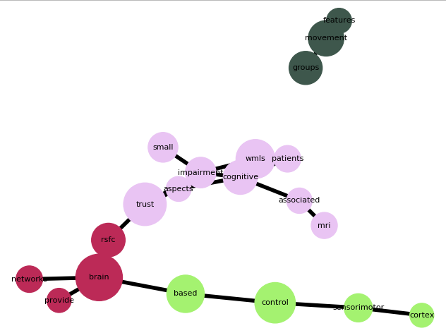

# Text-Network Analysis

Automatic pipeline for creating and visualizing text networks. It helps filter and group the most important words in the corpus by the means of centrality and community graph measures. It's and end-to-end solution that takes a text corpus as an input, and gives a visualized filtered graph with the most important words for interpretation, without the need of using any external software.

The tool is based on the work described in [1](http://www.ijssh.org/papers/459-CH357.pdf). Please cite this paper if you found this code useful.

## Dependencies

The code is written in python. The dependencies are:
* Python 3.6
* Networkx
* Matplotlib

## Example usage

An example corpus with a couple of PubMed open abstracts is included. To create and visualize a graph based on this corpus, simply run:

```python
python tna.py
```

It takes a couple of seconds to process the corpus on a desktop computer, however bigger corpuses with millions of words might need hours of calculation. After the calculations are done, you should get a visualization presented below:



## Features

The tool not only filters the most important words by the means of betweenness centrality, but also uses community detection to cluster the words partaining to the same topics together. The tool also saves the network in a .gml format that might be used in other popular network analysis programs.

## Reference

[1] M. Gruszecka & M. Pikusa. 2015. "Using Text Network Analysis in Corpus Studies--A Comparative Study on the 2010 TU-154 Polish Air Force Presidential Plane Crash Newspaper Coverage". International Journal of Social Science and Humanity.
